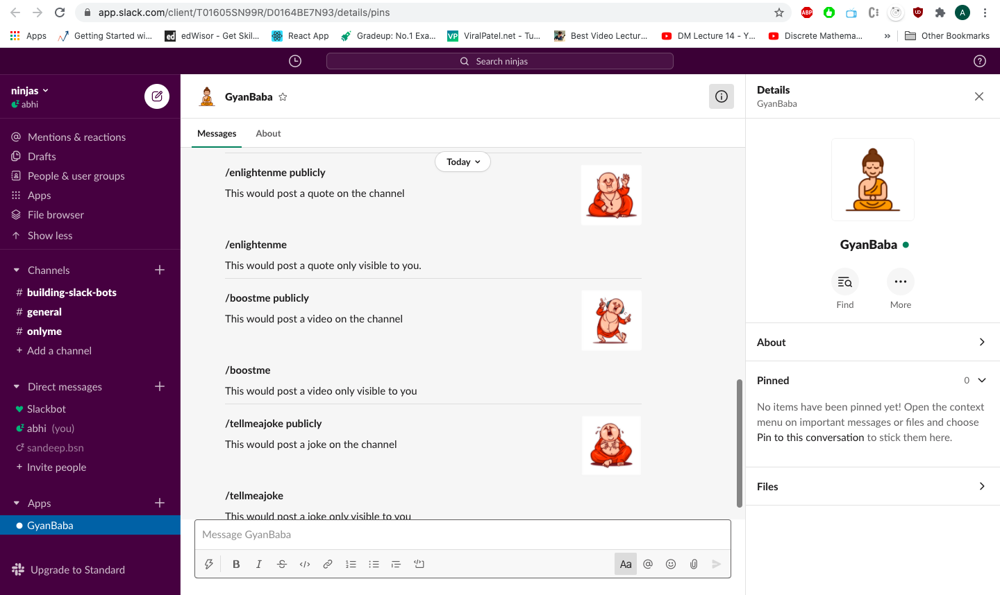
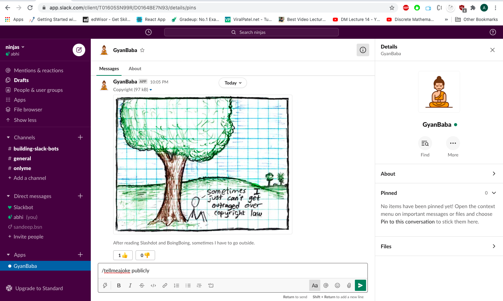
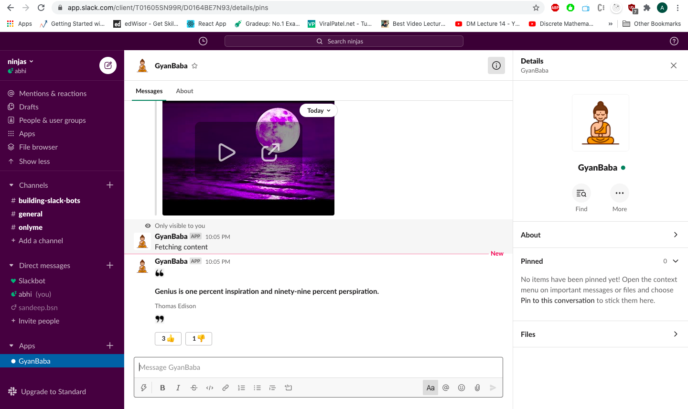
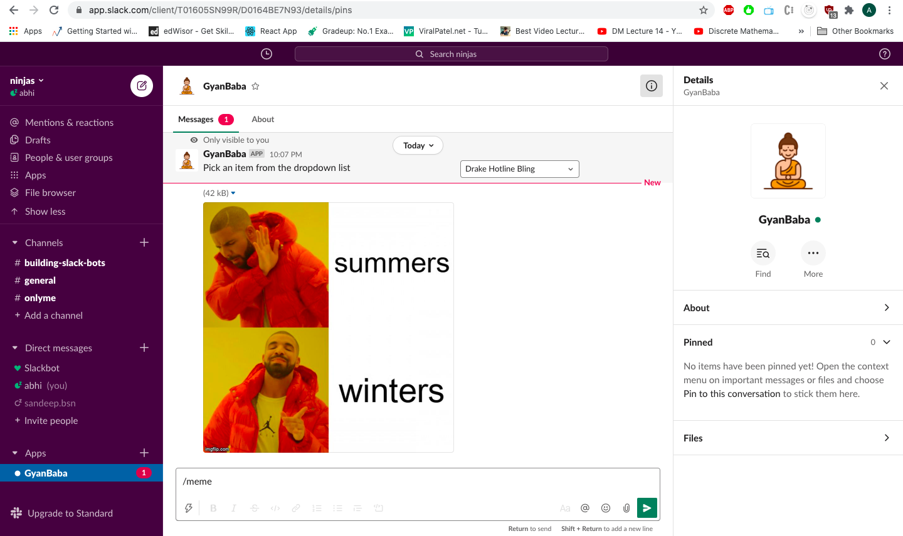
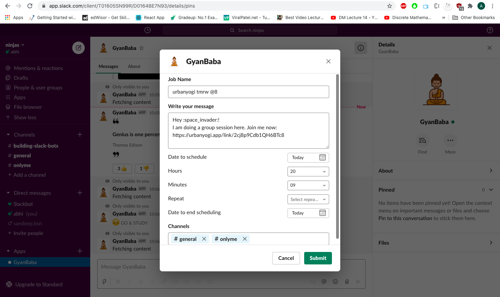

# Gyanbaba
    1. An app that helps people to overcome slack fatigue while using slack.
    2. An user can fetch random quotes, jokes or videos.
    3. They can also generate meme with the help of our meme generator
    4. It also helps them to schedule tasks to be executed at specific time
    5. User can fetch list of messages pinned by them

### Slash commands

### Getting a joke

### Getting a video and quote

### Generating a meme
Getting user inputs

Generating a meme

### Scheduling a task
Getting user inputs

Executing the task

### Getting the list of pinned messages

